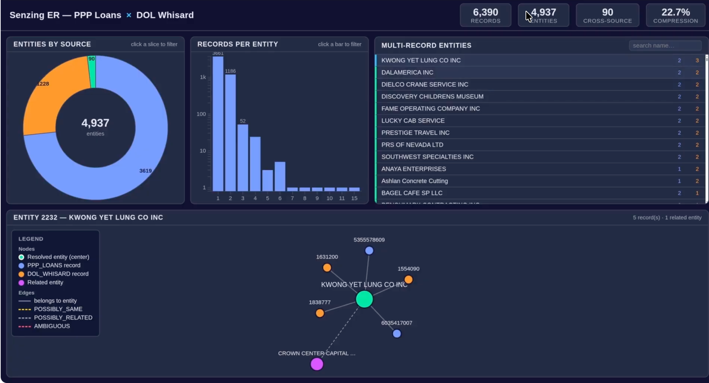

# Combine Data Sources & Explore Hidden Connections in PPP Loan Data

**The mission:** find the entities that appear in **both** the PPP loans and labor-violations data, and identify which are physicians.

> *The meal.* With **three plain-English prompts**: ingest two public data snapshots and get a
> merge report; (optionally) serve it up in a web visualizer; then fold in a third dataset and
> refresh. ~30 minutes, local kitchen. The beginner on-ramp for the whole cookbook.

**The finished meal** - an interactive dashboard over the resolved PPP-loan and labor-violation data:



*6,390 records across PPP loans and DoL violations resolve to **4,937 entities** (**22.7% compression**), **90** of them spanning both sources - and any entity's records and relationships are explorable as a graph.*

> ### ▶ [Watch the demo](https://youtu.be/SUQM4cKB2Hs)

> **Before you cook - a few reminders:**
> - **Use your most capable model** (e.g. Opus for Claude), not a fast or cheap one - these recipes do real, multi-step work.
> - **Yours will look different.** Your assistant builds the result fresh each run, so the layout and features vary - a chart or the graph may sit on a different tab. The demo shows the idea, not an exact target.
> - **The video is illustrative** - it may show a different assistant or interface; the prompts on this page are what to follow.

## Chef's Note

I wanted the simplest possible on-ramp: prove how easy it is to combine data, with the fewest
moving parts. So I took a couple of liberties. First, I used the **pre-mapped Las Vegas CORDs** -
Collections of Relatable Data, real-world public datasets Senzing has already mapped to its entity
spec and serves straight from the MCP, so there are no files to download and no mapping to do (that
keeps it to three prompts). Second, I made the **visualizer optional** because the merge report
alone already answers the question. We tell the AI *what* we want, not *how* - the kitchen handles
the how. Cook it on your own data by swapping the CORDs for your sources.

## Setup: What you'll need

- **Setup (one-time):** an AI coding assistant, the **Senzing MCP**, and your **Senzing license** - new to this? Start with **[Get Started](../getting-started.md)**.
- **Ingredients:** **PPP Loans** + **US Labor Violations** (Dept. of Labor), both Las Vegas CORD
  sources - the MCP supplies them. *(the **Plus** step adds **NPI**.)*

---

## Cook: Ingest and load data

Map + load both sources and resolve them. **This is the loader** - cook it properly. **Attach your Senzing license file to this chat** (the one you downloaded in Get Started), then paste:

```
Goal: Stand up Senzing, load in 2 pre-mapped datasets and generate a merge report.

Hard rules:
- Use the Senzing MCP. Do not rely on general training.
- Do not use sleep/wakeups.
- Use multithreading for loading.
- Use complete datasets.
- Process any redo records so resolution is complete.
- I have provided the Senzing license file: it is attached to this chat, or in your working folder. Do not guess a path - ask me if you can't find it.

Preferences:
- Provide me live status updates on the data ingestion.

Steps:
1. Deploy Senzing using the license file I provided.
2. Load the PPP and Department of Labor Compliance Action snapshots from the Las Vegas Senzing CORDs.
3. When resolution is complete, generate a merge report in markdown showing what Senzing did with the data.
```

**Expected outcome:** live ingest status, then a **merge report** - record and entity
counts, compression ratios, per-source summaries, entity-size distribution, and the **cross-source
matches.** In my run, **92 entities were shared between PPP and DoL** - the cross-source connections.

**Questions that may come up:**
- *Do I need to map the data?* No - CORDs are pre-mapped to the Senzing spec.
- *Where does the data come from?* The MCP fetches the complete CORD datasets; you don't supply files.
- *How long?* Minutes. If you see no live updates, remind it: *"provide live status, no sleep/wakeups."*

---

## Plate: Visualize the results (optional)

Serve the result in the **Simple Web Visualizer** place setting. *(Optional - skip if the report alone answers your question.)* Paste:

```
Goal: Utilizing the data already loaded into Senzing, create an interactive web visualizer including a summary dashboard and the ability to explore entities, including a network graph.

Hard rules:
- Use the Senzing MCP. Do not rely on general training.
- Don't forget the previous Hard Rules.
- If you can't start a local web server the user can open in a browser, build the same visualizer as a single self-contained static HTML file instead, keeping as many of the same features as possible.
- Only use a Senzing mart and/or the Senzing SDK to populate the UX. Do not use any direct database queries.
- Only present the network graph based on a selected entity. Never the whole graph at once.
- Follow the Senzing MCP reporting_guide for query patterns and graph layouts.
- Confirm the visualizer works before finishing: that the local site is responding, or (if you used the static-HTML fallback) that the file was written and opens.

Features:
- On the network graph visualization, present a list of entities - with the cross-source entities at the top - that the user can click on to select which entity to visualize in the graph.
- The UX should include a match summary screen with drill-down options.
- The UX should include a search feature, using the Senzing 'Search' method (including search by name, address, and other attributes).
- Present a network graph with labels to visualize the related entities.
- Keep visualization elements to one screen, no scrolling required, wherever possible.
- Provide a legend for the graph.
```

**Expected outcome:** a local URL → a dashboard with headline metrics, source comparison, match-key
breakdown, **search**, and a **network graph** rendered for a selected entity (with a legend),
cross-source entities at the top.

**Questions that may come up:**
- *Why only one entity's graph at a time?* The whole graph is unreadable at scale - that's a hard rule.
- *Can it query the database directly?* No - UX is populated only from a Senzing mart/SDK.

---

## Plus: Add additional data

Bring a third source to the table; it resolves together with the rest (cross-source) and re-plates. Paste:

```
Goal: Add one more data source to Senzing and update the visualization.

Hard rules:
- Use the Senzing MCP. Do not rely on general training.
- Don't forget the previous Hard Rules.

Steps:
1. Download the NPI (National Provider Index) snapshot from the Las Vegas Senzing CORDs.
2. Use Senzing to combine this data set with the other two data sets already loaded.
3. Refresh the output: if you built the web visualizer in the Plate step, update it; otherwise regenerate the merge report.
```

**Expected outcome:** the report refreshes to **3 sources (~76,000 records)** and **triple-merge
entities** appear - records resolving across all three (which providers took PPP loans *and* had
violations). The visualizer's legend gains NPI and new nodes show up.

**Questions that may come up:**
- *Does it reload everything?* It re-resolves the new source against what's already loaded - that's the cross-source magic.
- *Why are the triple-merges the interesting part?* They're the entities present in all three sources - the strongest cross-source connections.

---

## Wrap Up

In ~30 minutes and three prompts you stood up Senzing, resolved two (then three) sources, produced a
merge report, and (optionally) a visualizer - the foundation for almost everything else in the
cookbook. The same recipe works on *your* data: swap the CORDs and ask your own questions.
