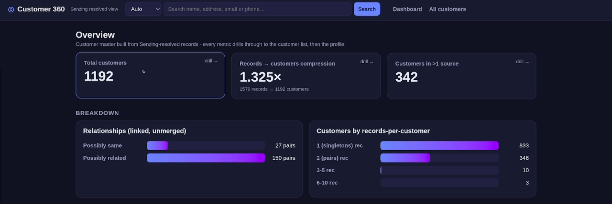

# Customer 360 from CRM + Orders

**The mission:** resolve a CRM export and an online-orders feed into one unified, searchable view of each customer, and flag likely duplicates for review.

> *The meal.* Build a **customer 360 database**: resolve a CRM export and an online-orders feed into one
> unified customer per person, then serve it as a 360 app - unified customer profile, complete order and
> account history, possible-duplicate review, and search. Intermediate, local kitchen, ~45 minutes.

**The finished meal** - one Customer 360 view built from two systems that never shared a key:



*1,579 records resolve to **1,192 customers** (**1.325× compression**), **342** span both CRM and online orders, and **177 possible-duplicate pairs** surface for review - the whole payoff on one landing page.*

> ### ▶ [Watch the demo](https://drive.google.com/file/d/13GlgoZLQ4XbO7zd5hJvqkhQi-7v9mNXt/view?usp=drive_link)
> *"Senzing Cookbook: Customer 360 from CRM + Orders."* &nbsp;<sub>(Google Drive for now - to be re-hosted, e.g. YouTube.)</sub>

> **Before you cook - a few reminders:**
> - **Use your most capable model** (e.g. Opus for Claude), not a fast or cheap one - these recipes do real, multi-step work.
> - **Yours will look different.** Your assistant builds the result fresh each run, so the layout and features vary - a chart or the graph may sit on a different tab. The demo shows the idea, not an exact target.
> - **The video is illustrative** - it may show a different assistant or interface; the prompts on this page are what to follow.

## Chef's Note

A Customer 360 is the thing every business says it wants: one complete, trustworthy view of each
customer, pulled together from every system that knows them. The hard part typically is that the different data sets that are used for these systems are rarely compatible with each other. In addition to being typically messy, they rarely have the things that you need like a common key to bring them together. Sales knows *Edward Flores, customer since 2012, VIP*; the storefront
knows *Ed Flores, six orders, ships to Summerlin*. They are the same people but nothing in the data joins them. That's the gap
entity resolution closes, and this recipe builds the whole thing on top of it.

There are two things worth calling out in this data. First, the two files **don't share field names.** The CRM has already split things out into `first_name` and `last_name` plus a `zip`, while the orders feed hands you a single `customer_name` to break apart, a set of `ship_*` address fields, and a `contact_phone` that's formatted completely differently. That mismatch is on purpose...mapping all of it over to the Senzing spec is part of the recipe, and the MCP's `mapping_workflow` handles that piece for you. And here's a fun wrinkle...the orders feed has no birthdate at all, because an online store wouldn't ever ask for one. So a shared email ends up being the thing that carries a customer across something like a move. Second, I served the whole thing through the **Entity Browser** place setting we set up below, stretched into a full Customer 360 app that shows useful things like each customer's profile, activity, related-customer review, and an overview dashboard.

## Setup: What you'll need

- **Setup (one-time):** an AI coding assistant, the **Senzing MCP**, and your **Senzing license** - new to this? Start with **[Get Started](../getting-started.md)**.
- **Ingredients:** two synthetic source files in [`ingredients/customer360/`](../ingredients/customer360/):
  - **CRM** - `crm.csv`, ~1,000 customers (columnar CRM export: name, address, phone, email,
    plus `customer_since` / `segment` / `lifetime_value`).
  - **ONLINE_ORDERS** - `online_orders.csv`, ~600 accounts (~400 are the same people as CRM
    customers; ~200 are online-only), with `order_count` / `last_order` as payload.
- *(Confirm before cooking: implementation language - don't assume Python; its binding is Linux-only.)*

---

## Prep: Stand up Senzing

Prepare your local machine to run Senzing. **Attach your Senzing license file to this chat** (the one you downloaded in Get Started), then paste:

```
Goal: Stand up a local Senzing instance, ready to load data.


Hard rules:
- Use the Senzing MCP. Do not rely on general training.
- Deploy Senzing locally using your Senzing license file; a local SQLite/in-memory datastore is fine for a POC.
- Confirm the instance is up and ready before finishing.
```

**Expected outcome:** a local Senzing instance, ready to load data into SQLite.
**Questions that may come up:**
- *Do I have to use SQLite?* No. If you prefer, you can specify any appropriate SQL database (PostgreSQL, MySQL, etc.), or none at all and allow Claude to create it for you. SQLite was specified here because of its ease of use for a POC.

## Cook: Ingest and load data

Get the CRM data in first - mapped, loaded, resolved. It's the customer master your 360 is built on. Unlike a
pre-mapped CORD, this is a raw export, so **mapping is part of the cook.** Let the MCP do it. Paste:

```
Goal: Using the existing local Senzing instance, map, load, and resolve the CRM customer export into a customer master.


Hard rules:
- Use the Senzing MCP. Do not rely on general training.
- Map the source with the Senzing MCP mapping_workflow - do not hand-code the Senzing JSON.
- Build the loader with the Senzing MCP sdk_guide.
- Use multithreading for loading.
- Do not use sleep/wakeups.
- Only map and load the requested data (crm.csv). Do not load in the online_orders.csv file yet.
- Map only the fields you need.


Preferences:
- Provide me live status updates on the data ingestion.


Steps:
1. Map and load crm.csv as data source CRM. Register the data source as CRM.
2. When complete, give me a short load summary: records loaded and resolved customers.
```

**Expected outcome:** a resolved **customer master** - one entity per customer - that everything else
hangs off. On its own it's just profiles from a single system; the 360 fills in when you serve it (the Plate
step) and add behavior + relationships (the Plus step).
**Questions that may come up:**
- *Why map at all - the CORD recipes didn't?* Those CORDs ship pre-mapped but real exports don't. The
  `mapping_workflow` reads the columns and maps them to the Senzing spec so you don't hand-write JSON.
- *Are `segment` / `lifetime_value` used for matching?* No - they're **payload**, carried along and
  shown on the profile, but not used to resolve identities.

---

## Plate: Visualize the results

Serve the customer master through the **Entity Browser** place setting, stretched into a full 360 app. Paste:

```
Goal: Build a Customer 360 web app on the resolved data in the existing Senzing instance, giving one complete view per customer.


Hard rules:
- Keep all previous Hard Rules in force.
- Use the Senzing MCP, not general training.
- Follow the Senzing MCP reporting_guide for every query, entity view, dashboard, and graph pattern.
- Populate the app only from a Senzing data mart and/or the Senzing SDK. No direct database queries.
- Create a network graph but only render the graph for a selected customer, never the full graph.
- Do not label the relationships in the network graph.
- Route every entry point (search, dashboard drill through, related customer link) to one shared customer detail screen.
- Confirm the app responds before finishing.


Preferences:
- Overview dashboard from the data mart report tables: total customers, records to customers compression, count of customers in more than one source, and a relationships breakdown. Make every metric a drill through that opens the underlying customer list, then the profile.
- Search by name, address, email, or phone.
- Provide a unified customer view showing things like the best known name plus addresses, phones, and emails aggregated across all of the customer's records.
- Source lineage: show the source labelled records behind each customer and allow drilling into each raw source record.
- On the network graph, provide the ability to turn on and off the different nodes in the visualization by clicking on them.
- On the profile, show the CRM payload (customer_since or tenure, segment, lifetime_value) alongside any online payload (order_count, last_order).
- Why match: for any linked pair, show the feature scores that resolved them side by side.
- How: for any merged records, using the Senzing HOW report to show the feature scores that merged them.


Steps:
1. Build a web app to show a Customer 360 view of the resolved data in the existing Senzing instance.
2. Create a network graph that shows the linkages between all records for a selected customer, including merged records of the same person, possibly same records, and possibly related records, (i.e. linked but unmerged customers).
```

**Expected outcome:** a local URL → an overview dashboard and a searchable customer list. Open a
customer and you get the **unified customer profile** with its source-labelled records and the CRM payload
(tenure, segment, value). Right now every customer is a single CRM record and related-customer links are
sparse - a clean baseline that comes alive in the next step.
**Questions that may come up:**
- *Can it query the SQLite file directly?* No - populate the app only from a Senzing data mart/SDK
  (place-setting rule).
- *Why only one customer's graph at a time?* The whole graph is impossible to appropriately visualize at scale - that's a hard rule.

---

## Plus: Add additional data

Adding in a new data set of a completely different nature can be really challenging. Bring the orders feed to the table; Senzing re-resolves it against the customer
master, and the flat profiles turn into true 360s. Its field names differ from the CRM - that's fine, the
`mapping_workflow` reconciles them. Paste:

```
Goal: Add the online orders feed to the existing Senzing instance and re-resolve all data across both sources.


Hard rules:
- Use the Senzing MCP. Do not rely on general training.
- Don't forget the previous Hard Rules.
- Use the MCP mapping_workflow to map the data. Do not hand-code the JSON.
- Register the data source as ONLINE_ORDERS. Multithread the load, complete file, no sleep/wakeups, and process all redo records.


Steps:
1. Map and load online_orders.csv as data source ONLINE_ORDERS.
2. Re-resolve so the online accounts link into the existing customers.
3. Refresh the Customer 360 app.
```

**Expected outcome:** the 360 comes alive. Open a customer who shops online and their profile now shows
**order history** (order count, last order) sitting next to their **CRM tenure, segment, and lifetime
value** - one complete view from two systems that never shared a key. Net-new **online-only customers**
appear (coverage the CRM never had). And the **related-customer** links fill in - records the engine
flags as likely the same person (e.g. a former/maiden name) but didn't merge, surfaced as possible
duplicates to review. The overview dashboard's cross-source and relationship numbers climb.
**Questions that may come up:**
- *Does it reload the CRM?* No - it resolves the new source against the master already loaded. That's
  the cross-source magic (and why the Plus step is the interesting move).
- *Why is a pair *related* instead of merged?* A shared address and first name but a different surname
  (a maiden/former name), with no shared email, is strong but not conclusive - so the 360 links it as a
  **possible duplicate** rather than silently merging. The *Season to taste* refinement below is how
  you'd confirm a merge.

---

## Optional refinements

- **Garnish the plate** (safe, presentation only) - turn on **"Why match?"** and **How** for a unified
  customer to show the feature scores that merged their records (name family, matching email, shared
  address), and use the related-customer graph to explore possible duplicates.
- **Season to taste** (stewardship - merge/split) - when a *related* customer really is the same person
  (a confirmed maiden-name change, say), a steward can **confirm the merge**, folding them into one
  unified record across every view. Powerful and risky - **gate it**: confirm each merge/split before
  it's written, never automatic.
- **Living database** (optional) - add one new order for an existing customer (or a brand-new shopper)
  and re-resolve; the 360 updates that customer's profile in place, no full reload. That's the database
  working the way it would in production.

## Wrap Up

In ~45 minutes you built a **Customer 360 database**: two mismatched source systems mapped and resolved
into one unified customer each, served as an app with unified customer profiles, complete CRM-plus-online
history, possible-duplicate review, search, and an overview dashboard. Swap in your own CRM and order data (mind the
PII) and the same three moves - cook, serve, add - give you a 360 on real customers.

## Changelog
- 0.2.3 - link the demo video (Google Drive temp host; re-host to YouTube for publish).
- 0.2.2 - updated all prompts to match the video.
- 0.2.1 - terminology fix: the read-only Phase 1 profile is a **unified / consolidated view**, not a "golden record." A true golden record applies survivorship (best value per field) and is a later refinement. Grounded against `senzing-mcp:search_docs` (merge/purge survivorship = deciding which field values to keep) and industry MDM usage.
- 0.2.0 - reframed from truth-set grading to building a customer 360 database (golden-record profiles, complete history, related/possible-duplicate review, dashboard, search).
- 0.1.0 - initial draft (synthetic CRM + ONLINE_ORDERS with engineered overlap and ground-truth manifests).
