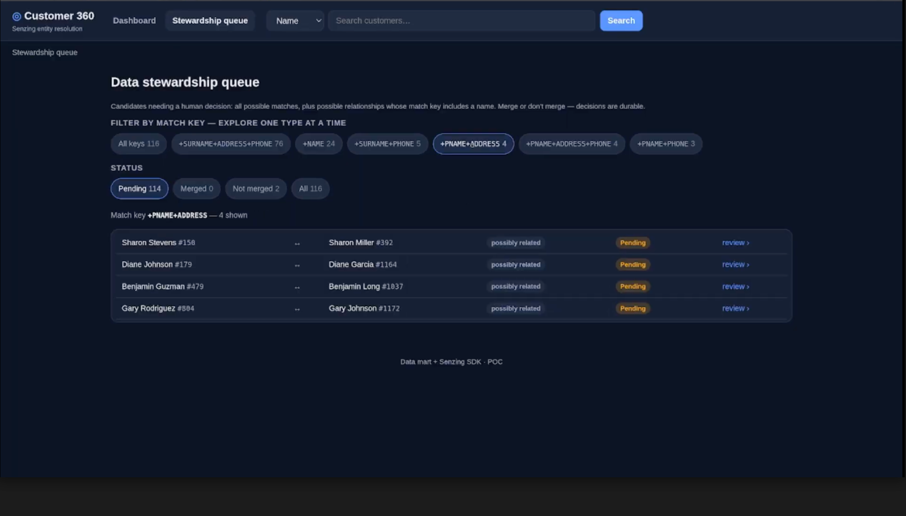

# Stewardship on CRM + Online Orders

**The mission:** add a stewardship queue to the Customer 360 app, surface what needs a human decision, show each candidate pair side by side, and let a human decide Merge or Don't merge.

**The finished meal:** the original Customer 360 app you created before with a new tab added, controlling the data stewardship queue:



*From here a human can review potential matches that didn't meet Senzing's confidence threshold, and decide whether to merge or not merge them.*

> ### ▶ [Watch the demo](https://drive.google.com/file/d/1j19nGlykBod8rPw-9m281bMTLCkGFACc/view?usp=sharing)
> *"Senzing Cookbook: Stewardship on CRM + Online Orders."* &nbsp;<sub>(Google Drive for now - to be re-hosted, e.g. YouTube.)</sub>

> **Before you cook - a few reminders:**
> - **Use your most capable model** (e.g. Opus for Claude), not a fast or cheap one - these recipes do real, multi-step work.
> - **Yours will look different.** Your assistant builds the result fresh each run, so the layout and features vary - a chart or the graph may sit on a different tab. The demo shows the idea, not an exact target.
> - **The video is illustrative** - it may show a different assistant or interface; the prompts on this page are what to follow.
> - **Run through the [Customer 360](./customer-360-crm-online.md) recipe first** - this recipe builds on it, so you need the Customer 360 app and its data already in place.

## Chef's Note

In the Customer 360 (C360) recipe, we cooked up a handy little web app for exploring the ER results from two data sources - a CRM and a database of online orders. The app was useful for showing a variety of things, such as the basic ER statistics like compression ratio, which records were combined to form a single entity, and how different records were possibly related or possibly the same. But one thing this app did *not* have was a way to take action on any of that data.

It would be really helpful to surface certain results to a human for further review beyond Senzing's ER. For example, if two records were not a high enough confidence match to be automatically merged, but they were still a possible match, it would be useful to show those two records side by side and let a human decide whether to merge them or not. In other words, we are looking to add a data stewardship queue to our existing C360 app.

The good news is that a basic queue can be added with just a single prompt! Once you run it, you will have the ability to explore these possible matches sorted by Senzing's match key. Every user likely has a slightly different need and take on stewardship, but this basic functionality will allow you to quickly identify which match keys are most important to your business and which ones you want to focus on first. You can then refine the queue and the review screen to your heart's content.


## What you'll need

- **Setup (one-time):** an AI coding assistant, the **Senzing MCP**, and your **Senzing license** - new to this? Start with **[Get Started](../getting-started.md)**.
- **Ingredients:** two synthetic source files in [`ingredients/customer360/`](../ingredients/customer360/):
  - **CRM** - `crm.csv`, ~1,000 customers (columnar CRM export: name, address, phone, email,
    plus `customer_since` / `segment` / `lifetime_value`).
  - **ONLINE_ORDERS** - `online_orders.csv`, ~600 accounts (~400 are the same people as CRM
    customers; ~200 are online-only), with `order_count` / `last_order` as payload.
  - **The Customer 360 app** - built from the [Customer 360 recipe](./customer-360-crm-online.md), with `CRM` and `ONLINE_ORDERS` loaded and resolved.
- *(Confirm before cooking: implementation language - don't assume Python; its binding is Linux-only.)*

---

## Step 1 - Prepare the kitchen

Prior to running this recipe, you will want to have already prepared the Customer 360 recipe, which we will build off of here.

## Step 2 - Build the review queue

```
Goal: You are working in the Customer 360 project - either the folder where you built it earlier, or a fresh rebuild of it. The local Senzing instance has CRM and ONLINE_ORDERS loaded and resolved, and the Customer 360 app is here. Add a data stewardship queue to that app: surface what needs a human decision, show each candidate pair side by side, and let a human decide Merge or Don't merge.

Hard rules:
- Work in the existing Customer 360 project and app. Do not stand up a second Senzing instance or build a parallel app. If you cannot find the instance or the app, ask me rather than guessing.
- Use the Senzing MCP. Do not rely on general training.
- Follow the Senzing MCP reporting_guide for query patterns and why-match interfaces.
- Read entity state only through a Senzing data mart or the Senzing SDK. Never query Senzing's internal engine tables directly.
- The only steward decision is Merge or Don't merge. Do not build force-apart, split, or unmerge - that is a separate over-merge workflow and is out of scope.
- What qualifies for review: all possible matches, plus any possible relationship with name in the match key. Nothing else enters the queue.
- Once a decision is made the item leaves pending for its status. Nothing stays pending after a decision.
- Merges are durable, not one-off: use the MCP's stewardship override-table pattern, exceptions-only, so a merge survives re-resolution.
- Always record in the override table what decision was made (merge vs. don't merge), who made it, when, and why.
- Use TRUSTED_ID_TYPE of STEWARD as the namespace. Merge means the pair shares one TRUSTED_ID_NUMBER under type STEWARD.
- Gate the merge: confirm before it is written. Never automatic.
- Keep the mart current incrementally, never by rebuilding it. Call add_record and redo processing with SZ_WITH_INFO, and refresh only the entities named in AFFECTED_ENTITIES.
- After a merge, drain the redo queue, then show the steward the resulting merged entity - the records it now contains and its profile after the decision - so they see the outcome, not just a confirmation.

Preferences:
- On the stewardship page, provide buttons near the top of the app for each of the match keys so I can explore a single type of potential match at a time.
- Group the queue by match key - the feature combination that made the pair a candidate - and let the steward filter by it, largest group first. Label each group in plain language, not just the raw key.
- One review screen per item: the two candidate records side by side, shared and conflicting features called out, why-match scores, source lineage for both sides, and a way to open the full profile.
- Provide a status filter for pending, merged, and not-merged. Keep decided items visible under their status rather than deleting them.
- Add the queue as a single new view in the existing app. Do not create a second entry point that resolves to the overview - clicking the stewardship queue must open the queue. Reuse the shared customer detail screen.

Steps:
1. Stand up the override table and wire the loader to use it. Prove the injection path works by round-tripping one test stamp, then clear it.
2. Build the queue from the qualifying relationships, each item carrying its record IDs, entity IDs, match key, feature scores, and source lineage, then build the review screen and wire both decisions.
3. Prove one merge is real: confirm from the data mart or SDK that the pair now resolves to a single entity, and that it holds after re-resolution. Then summarize - rows in the override table, items by status, which entity IDs you refreshed, and how the overview dashboard's numbers shifted.
```

**Expected outcome:** a new tab added to the existing C360 app for stewardship. Clicking into it should show a queue of possible matches, grouped by match key, with buttons to filter by match key. Clicking into a queue item should show a list where you can click on the two candidate records side by side, with shared and conflicting features called out and a way to open the full profile. The steward should be able to decide Merge or Don't merge, and the decision along with the name of the steward should be recorded in the override table with who made it, when, and why. After a merge, the steward should see the resulting merged entity.

## Wrap Up

In about 20 minutes you were able to add a functioning stewardship queue to the Customer 360 app, allowing a human to review possible matches and decide whether to merge or not. You can now explore the queue, filter by match key, and see the results of your decisions reflected in the data mart.

## Changelog
- 0.1.1 - Complete recipe update based on final video.
- 0.1.0 - initial draft (starting with C360 already run).
