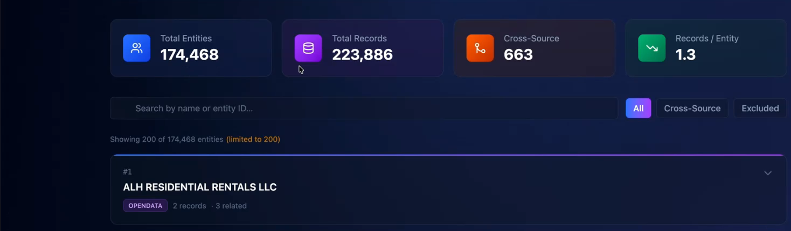

# Healthcare Exclusion Screening

**The mission:** screen Las Vegas healthcare providers against the OIG exclusion list and flag any that appear on it.

> *The meal.* Map two provider datasets, deploy an AWS pipeline, run Senzing V4 ER and export; serve
> it in an Entity Browser; then add OIG LEIE exclusions and flag excluded providers. SE/advanced.

**The finished meal** - an Entity Browser over the resolved provider repository:



*223,886 provider records resolve to **174,468 entities**, **663** of them cross-source - browse, search, or filter to the **Excluded** ones flagged against the OIG list.*

> ### ▶ [Watch the demo](https://drive.google.com/file/d/1jT0Ei6jhhpGUlPwfbEm2WwjHjy4dOXh3/view?usp=drive_link)
> *"Senzing Cookbook: Excluded Las Vegas Doctors."* &nbsp;<sub>(Google Drive for now - to be re-hosted, e.g. YouTube.)</sub>

> **Before you cook - a few reminders:**
> - **Use your most capable model** (e.g. Opus for Claude), not a fast or cheap one - these recipes do real, multi-step work.
> - **Yours will look different.** Your assistant builds the result fresh each run, so the layout and features vary - a chart or the graph may sit on a different tab. The demo shows the idea, not an exact target.
> - **The video is illustrative** - it may show a different assistant or interface; the prompts on this page are what to follow.

## Chef's Note

I built this in a real **AWS production kitchen**, not a laptop - the goal was an operational
compliance system that keeps running, not a one-off demo. A couple of liberties: I **borrowed
Clair's network-graph** idea for the place setting rather than reinvent it, and I **limited the OIG
load to last names starting "A"** to keep the walkthrough snappy (drop that filter to load them
all). The payoff was real: the exclusions overlay surfaced actual excluded Las Vegas doctors.

> ⚠️ **Not a quick live demo** - real AWS infra, hours of build time, real charges. 

## Setup: What you'll need

- **Setup (one-time):** an AI coding assistant, the **Senzing MCP**, and your **Senzing license** - new to this? Start with **[Get Started](../getting-started.md)**.
- **AWS environment:** **production** - CDK/RDS/ECS/Glue/Step Functions, IAM via STS, AWS Docs MCP, creds. A substantial build.
- **Ingredients:** **NPPES NPI** + **OpenData.org** (Las Vegas), pre-staged in
  `s3://npi-public-data-input-raw/`. *(the **Plus** step adds **OIG LEIE exclusions**.)*

---

## Cook: Ingest and load data

Map both sources, deploy the AWS pipeline, run ER, export. **The loader must be production-grade.** **Attach your Senzing license file to this chat** (the one you downloaded in Get Started), then paste:

```
Important: Use the Senzing MCP for all Senzing work. Use the AWS Documentation MCP for any AWS CDK questions.

Goal: Map two pre-staged healthcare provider datasets, deploy a fully automated AWS CDK pipeline, run Senzing V4 entity resolution, and export the resolved entity graph.

Hard rules:
- Use the Senzing MCP's mapping_workflow for all field mappings - not training knowledge.
- Use the Senzing MCP's sdk_guide for all SDK calls and loader patterns.
- Check the Senzing MCP anti-patterns docs before implementing the loader. Use a production-grade loader - not a demo or single-threaded process.
- Process redo records so resolution is complete.
- Use CDK for all AWS infrastructure. Prefix every resource with npi-public-data-* and deploy the CDK to AWS region us-east-1. I acknowledge and accept all AWS charges for these actions.
- Deploy using IAM role npi-public-data-deploy via AWS STS. Include a CDK-aware IAM policy template.
- Split large IAM policies by domain so each is under the 6,144 character limit.

Data sources (pre-staged in s3://npi-public-data-input-raw/):
- NPPES NPI: licensed healthcare providers, Las Vegas, NV
- OpenData.org: commercial provider enrichment, Las Vegas, NV

License & Credentials: The Senzing License is attached, and the RDS password is located in the ./Credentials/creds.txt file.

Steps:
1. Inspect both source files and propose field mappings using the Senzing MCP mapping_workflow. Show the mappings for my review before proceeding.
2. Once I approve, synthesize and deploy the CDK stacks (storage, networking, database, ECS, Glue ETL, Step Functions orchestration).
3. Run the Senzing V4 entity resolution pipeline. Print progress every few seconds as records load.
4. When fully loaded, export the resolved entity graph to S3 and print a summary match report.
```

**Expected outcome:** it proposes **field mappings and pauses for your review** - approve to
continue. Then CDK stacks deploy, the pipeline loads with progress printed, the graph exports to S3,
and a summary report prints. My run: **~223,000 records → ~174,000 entities; 663 cross-source overlaps.**

**Questions that may come up:**
- *It stopped after the mappings.* By design - review and approve before it builds.
- *Cost / time?* Real AWS charges; ~hours end to end.
- *A database-init step appeared.* Expected - the pipeline registers data-source IDs / initializes the DB before loading.

---

## Plate: Visualize the results

Serve it in the **Entity Browser** place setting. Paste:

```
Important: Use the Senzing MCP's reporting_guide for this task.

Goal: Build an Entity Browser web UI that loads the resolved entity export from the previous step and lets users explore the identity graph.

Hard rules:
- Follow the Senzing MCP reporting_guide for all query patterns, graph layouts, and why-match interfaces.
- Populate the UX only from a Senzing data mart and/or the Senzing SDK. No direct database queries.
- Only render the network graph for a selected entity. Never the whole graph at once.

Features:
- Search across resolved entities by name, entity ID, or exclusion status (using the Senzing query interface).
- Show resolved entities with their linked source records, clearly labelled by source (NPPES NPI or OpenData.org).
- Network graph with labels to visualize the identity graph and entity-record relationships.
- "Why match?" with feature scores for any selected entity pair.
```

**Expected outcome:** an Entity Browser web UI - search by name / entity ID / exclusion status;
entities with **source-labeled** records; a labeled **network graph**; **"Why match?"** with feature
scores for a selected pair.

**Questions that may come up:**
- *Where do the query/graph patterns come from?* The MCP's `reporting_guide` - don't hand-roll them.

---

## Plus: Add additional data

Add the exclusions list; it re-resolves against the providers and the browser re-plates. Paste:

```
Important: Use the Senzing MCP for this task.

Goal: Add OIG LEIE exclusions as a third data source, then flag and visually highlight any resolved entities linked to OIG exclusion records.

Steps:
1. Map and load records whose last name start with the letter A from the OIG LEIE exclusions dataset into the existing identity graph using the same production-grade loader as before (use the Senzing MCP mapping_workflow).
2. Update the Entity Browser to:
   - Show a clear exclusion flag or badge on any entity linked to an OIG exclusion record.
   - Add exclusion status as a filterable field in the search interface.
   - Visually highlight OIG-linked entities in the network graph (e.g., a distinct color or node border).
3. Print updated match statistics: how many resolved entities now have an OIG exclusion link, broken down by individual vs. organization.
```

**Expected outcome:** OIG records load and **re-resolve** against the existing providers, surfacing
**excluded doctors** (the video found **Victor C. Sutton** and **Everton's Place**, both tied to
real Nevada medical-fraud cases). The Entity Browser re-plates: **exclusion badges**, an
**exclusion-status filter**, **highlighted** OIG-linked nodes; updated stats print (individual vs. org).

**Questions that may come up:**
- *Why only last name "A"?* The demo limits the OIG load to last-name-A for speed; drop the filter to load all.
- *Did it merge OIG into existing entities?* Yes - that's how excluded providers get flagged.

---

## Wrap Up

You built a **production** healthcare-provider compliance system on AWS - resolved repository,
Entity Browser, and an OIG-exclusion overlay that surfaced real excluded providers - in hours, not
months. This is a *restaurant*, not a one-time dinner: it keeps running.
